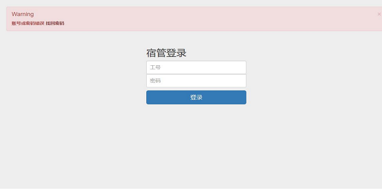
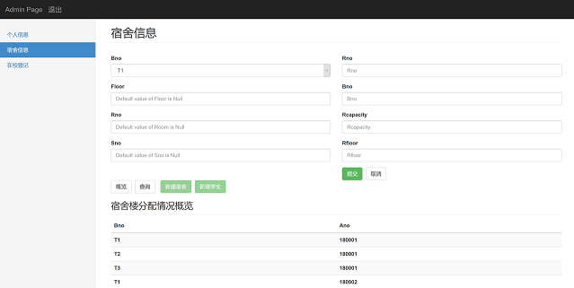
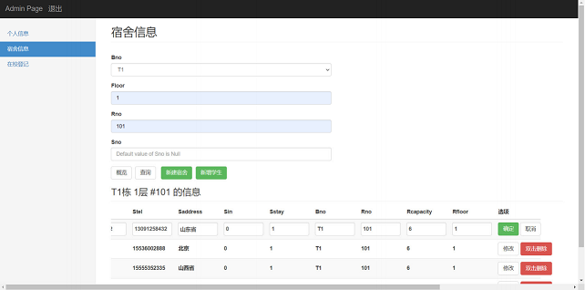
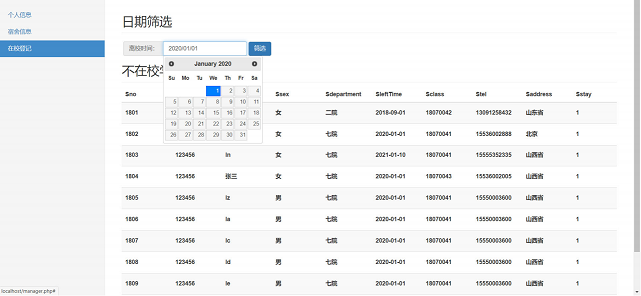
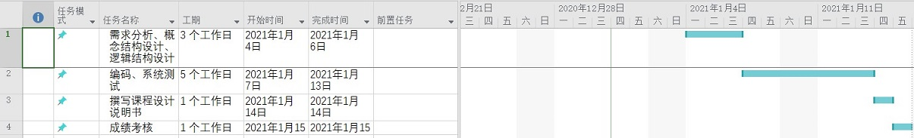

## RoomManagementSystem(宿舍管理系统)


### 更新记录
1. 20210118 从私有库中清除敏感信息，清除开发历史记录，项目开源


### 界面概览






### 工作计划及进度

- 1.4 - 1.6 **需求分析**、概念结构设计、逻辑结构设计(进一步细化任务)
- 1.7 - 1.13 编码、系统测试
- 1.14 撰写课程设计说明书
- 1.15 成绩考核


### 任务
1. 对"宿舍管理系统"进行需求调研，完成概念模型和逻辑结构设计
2. 建立"宿舍管理系统"数据库
3. 编程实现"宿舍管理系统"  
   **包含:**
   1. 用户登录模块（用户登录，用户信息的添加、删除、修改和密码管理）
   2. 学生信息管理模块（更新和维护系统中的学生信息，包括对学生信息的查询、修改、插入和删除等的操作）
   3. 宿舍管理模块（更新和维护系统中的宿舍信息，包括对宿舍信息的查询、修改、插入和删除等的操作）
   4. 学生住宿信息管理（学生住宿床位的分配和对住宿情况多条件组合查询）


### 工作量的要求：
1. 完成系统各个阶段的分析和设计，并以规范化形式显示
2. 实现系统的具体逻辑功能和友好的人机交互


### 工具
1. 前端：HTML、CSS
2. 前端框架：Bootstrap v3.3.7
3. Web 编程：JavaScript
4. JavaScript框架：jQuery UI v1.12.1、jQuery v3.5.1
5. 后端：PHP-8.0.0-nts-Win32-vs16-x64
6. Web服务器：Nginx-1.19.6
7. 运行环境：Microsoft Edge 87.0.664.75 (官方内部版本) (64 位)
8. 数据库：mysql Ver 8.0.21-0ubuntu0.20.04.4 for Linux on x86_64 ((Ubuntu))


### Something About HowToUse
    [注] 如果使用PHP storm不需要下载datagrip
1. 下载并安装[DataGrip](https://www.jetbrains.com/datagrip/) 
2. DataGrip 连接远程数据库
3. 注册[codechina](https://codechina.csdn.net/)
4. 安装git便携版并配置环境变量
5. 提交时输入账号密码  
   
   或者，使用ssh秘钥对，在power shell中输入`ssh-keygen -t rsa -b 4096`生成密钥对


### 环境配置
1. nginx [下载](http://nginx.org/download/nginx-1.19.6.zip)  
   配置：server部分写入以下 root路径与网站路径相同   
   ```cpp
   server {
        listen       80;
        server_name  localhost;

        location / {
            root   D:\Sources\RoomManagementSystem\Page;
            index  index.html index.htm;
        }

        error_page   500 502 503 504  /50x.html;
        location = /50x.html {
            root   html;
        }

        location ~ \.php$ {
            root           D:\Sources\RoomManagementSystem\Page;
            fastcgi_pass   localhost:9000;
            fastcgi_index  index.php;
            fastcgi_param  SCRIPT_FILENAME  $document_root$fastcgi_script_name;
            include        fastcgi_params;
        }
   }
   ```
2. 下载[xdebug](https://xdebug.org/files/php_xdebug-3.0.1-8.0-vs16-nts-x86_64.dll)  
   配置：将其解压出后放入`php-8.0.0-nts-Win32-vs16-x64\ext\`文件夹中

3. 下载[VS16 x64 Non Thread Safe](https://windows.php.net/downloads/releases/php-8.0.0-nts-Win32-vs16-x64.zip)  
   配置：将`php.ini-development`文件拷贝为`php.ini`，并写入
   ```cpp
   extension_dir = "ext"
   cgi.fix_pathinfo=1
   extension=mysqli

   [xdebug]
   zend_extension="D:\Program Files\php-8.0.0-nts-Win32-vs16-x64\ext\php_xdebug-3.0.1-8.0-vs16-nts-x86_64.dll"
   xdebug.mode=debug
   xdebug.client_host=127.0.0.1
   xdebug.client_port=9003
   ```
4. 下载PhpStorm  
   修改phpStorm调试端口 9003
5. 启动nginx
   1. 启动nginx，cd到nginx所在根目录，执行`start nginx` 
   2. [注]`nginx -s reload`重启 `nginx -s stop`停机
6. 启动php环境  
   `php-cgi.exe -b localhost:9000 -c php.ini`
